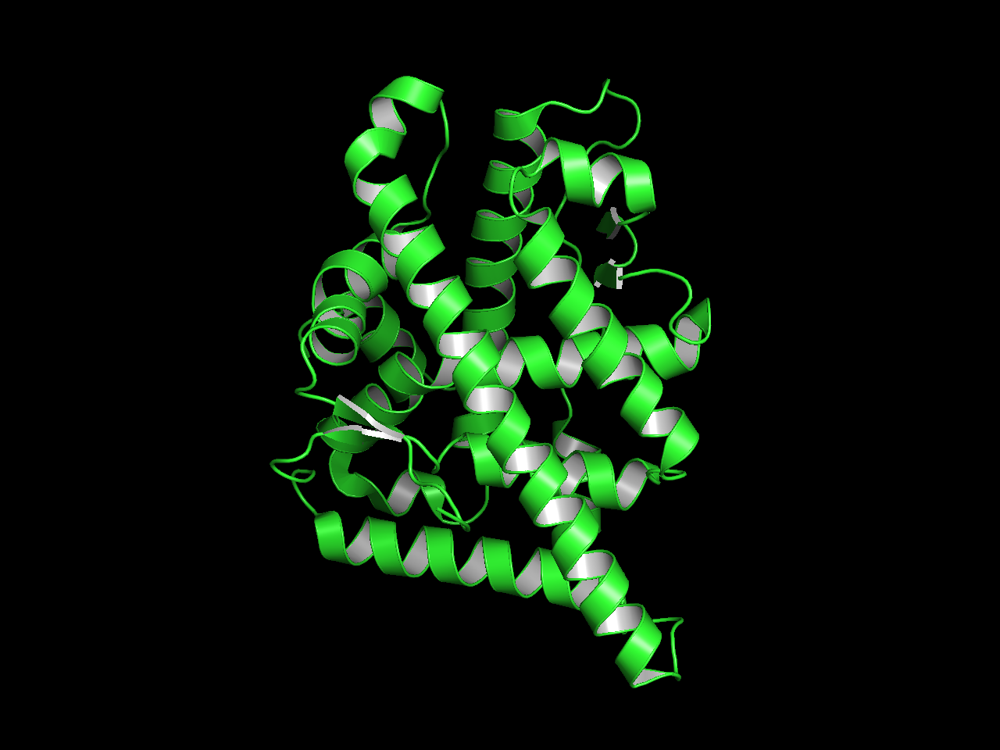
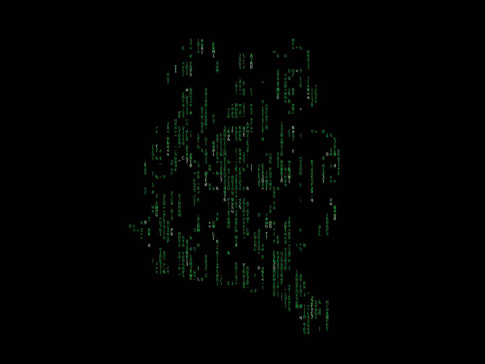

# Matrix Protein Rain

**A Matrix-style digital rain visualization for protein structure images.**

Author: **Jesus Seco, PhD**

---

## Overview

**Matrix Protein Rain** transforms a PyMOL protein render into a flowing
"digital rain" animation — the iconic falling-character effect from *The
Matrix* — where letters, numbers, and symbols cascade down the screen in
bright green, tracing the silhouette and secondary structure of the protein.

The tool was designed and tested with **secondary-structure / backbone
representations** (PyMOL cartoon diagrams showing alpha-helices and loops),
but works with any image that has a clearly colored structure on a dark
background.

| Input (PyMOL cartoon) | Output (Matrix rain) |
|:---:|:---:|
| <p align="center"></p> |  <p align="center">  </p> |

## How It Works

1. **Detection** — The script analyzes the input image and detects pixels
   that belong to the protein (green channel dominates over red and blue
   against a black background).

2. **Zoom** — The image is automatically cropped to the protein's bounding
   box, removing empty space and focusing on the structure.

3. **Grid downsampling** — The mask is reduced to a coarse character grid
   where each cell corresponds to a block of pixels.

4. **Digital rain engine** — Columns containing protein pixels receive
   multiple character streams that fall slowly downward. Each stream has a
   bright "head" and a fading "tail" of green characters.

5. **Persistence effect** — Characters don't vanish instantly; they decay
   slowly (fade rate = 0.92 per frame), so the secondary structure remains
   visible: alpha-helices appear as dense vertical columns of characters,
   while loops show as sparse connections between them.

6. **Rendering** — The engine produces an animated GIF, a static PNG (best
   coverage frame), and a plain-text matrix file.

## Outputs

| File | Format | Description |
|---|---|---|
| `protein_matrixome.gif` | GIF | Animated digital rain effect |
| `protein_matrixome.png` | PNG | Static frame with highest protein coverage |
| `protein_matrixome.txt` | TXT | Plain-text matrix of characters |

## Quick Start

### Prerequisites

- [Pixi](https://pixi.sh) (recommended) — handles all dependencies automatically
- Or manually: Python >= 3.10, NumPy >= 1.24, Pillow >= 10.0

### Using Pixi (recommended)

```bash
# Install the environment
pixi install

# Run with default settings
pixi run python protein_matrixome.py protein.png

# Custom duration and block size
pixi run python protein_matrixome.py protein.png 5 6
```

### Using plain Python

```bash
pip install numpy pillow
python protein_matrixome.py protein.png 5 6
```

## Usage

```bash
python protein_matrixome.py <image> [duration] [block_size]
```

### Arguments

| Argument | Default | Description |
|---|---|---|
| `image` | *(required)* | Path to the protein image (PNG/JPG) |
| `duration` | `5` | GIF duration in seconds |
| `block_size` | `6` | Downsampling block size in pixels. Smaller = more detail but slower |

### Examples

```bash
# Default settings (5 seconds, block size 6)
python protein_matrixome.py my_protein.png

# Longer animation, finer detail
python protein_matrixome.py my_protein.png 8 4

# Shorter animation, coarser grid (faster)
python protein_matrixome.py my_protein.png 3 10
```

## Input Image Guidelines

For best results, render your protein in PyMOL with:

- **Background**: Solid black (`bg_color black`)
- **Representation**: Cartoon / ribbon (shows secondary structure clearly)
- **Color**: Green (`color green`)
- **Format**: PNG or JPG
- **Resolution**: 1000×1000 px or higher

The script is optimized for green-on-black images but can be adapted for
other color schemes by modifying the `load_and_detect()` threshold logic.

## Configuration

Key parameters can be adjusted in the script or via command-line arguments:

| Parameter | Default | Location | Effect |
|---|---|---|---|
| `threshold` | `20` | `load_and_detect()` | Green detection sensitivity (lower = more sensitive) |
| `padding` | `12` | `crop_to_protein()` | Margin around protein bounding box (%) |
| `density` | `3.0` | `MatrixRain.__init__()` | Streams per column (higher = denser rain) |
| `fade_rate` | `0.92` | `MatrixRain.__init__()` | Character persistence (higher = structure stays longer) |
| `char_size` | `16` | `main()` | Pixel size of each character (larger = bigger glyphs) |
| `fps` | `12` | `main()` | Animation frames per second (lower = slower movement) |

## Character Set

The digital rain uses 89 unique ASCII characters:

- Digits: `0-9`
- Uppercase: `A-Z`
- Lowercase: `a-z`
- Symbols: `@#$%&*+=<>?/\|:;~^!{}[]()_-`

## File Structure

```
matrix-protein-rain/
├── protein_matrixome.py    # Main script
├── pixi.toml            # Pixi environment definition
├── README.md            # This file
├── protein_matrixome.gif   # Output: animation (generated)
├── protein_matrixome.png   # Output: static frame (generated)
└── protein_matrixome.txt   # Output: text matrix (generated)
```

## Dependencies

| Package | Minimum Version | Purpose |
|---|---|---|
| Python | 3.10 | Runtime |
| NumPy | 1.24 | Array operations, mask processing |
| Pillow | 10.0 | Image loading, rendering, GIF export |

## Author

**Jesus Seco, PhD**

## License

This project is provided as-is for research and educational purposes.
